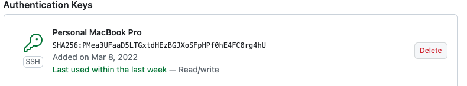
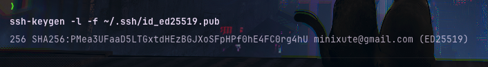
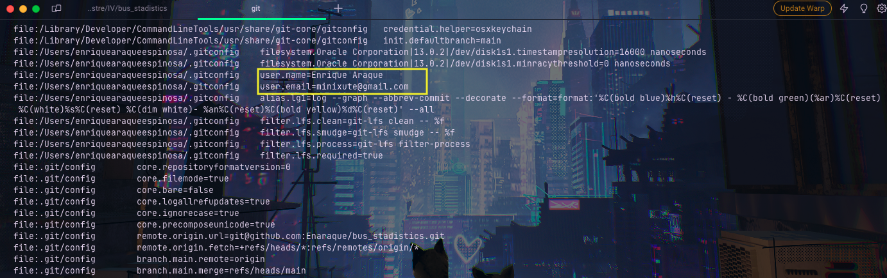

# Configuración inicial de git y gitHub

## Configuración de las claves

### Clave en gitHub
 

### Clave en el equipo local

## Configuración correcta del nombre y correo electrónico

## Perfil personal de gitHub
