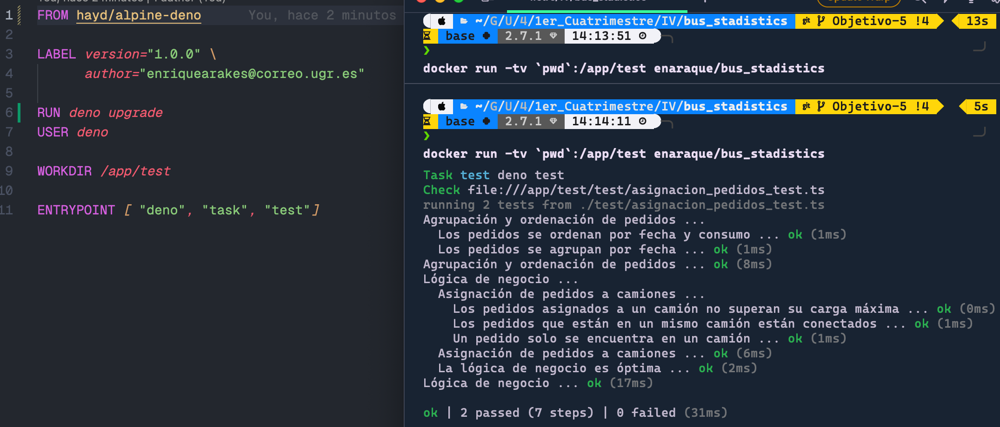
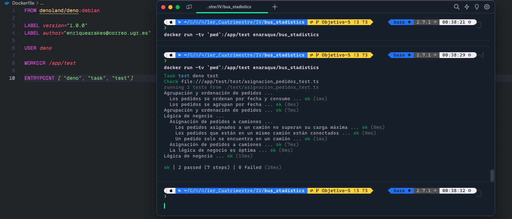

# Elección imagen de Docker

## Criterios de selección

Mis criterios de selección para la imagen de Docker son los siguientes:

1. **Ligereza:**
   - Con esto nos aseguramos que se reduce el número de herramientas instaladas
   las cuales no vamos a utilizar en nuestro proyecto.

2. **Compatibilidad con Deno:**
   - Asegurar que la imagen sea compatible con Deno, ya que se utiliza como runtime.

3. **Mantenimiento Activo:**
   - El mantenimiento activo es crucial para garantizar actualizaciones y correcciones
    de seguridad regulares.

4. **Deno Preinstalado:**
   - Preferiblemente, la imagen debe tener Deno preinstalado para simplificar la ejecución
    de aplicaciones y tests sin necesidad de instalaciones manuales.

5. **Rapidez:**
   - Buscamos una imagen, que aparte de ser ligera, también sea rápida a la hora de realizar
   la ejecución.

## Imágenes de Docker Consideradas

A la hora de elegir una imagen, vamos a considerar las imágenes que vienen con deno
preinstalado ya que nos aporta una mayor comodidad. A partir de ahí, tendremos en
cuenta los demás criterios de selección.

Las imagenes consideradas son las siguientes:

- [hayd/alpine-deno](https://hub.docker.com/r/hayd/alpine-deno): Esta imagen es
    la más ligera de todas las consideradas, con un tamaño de **39.32 MB**. En un principio
    podríamos pensar que es la mejor candidata, pero lleva sin ser actualizada desde
    hace 3 años. Esto además ocasina que no reconozca el archivo `deno.json` ya que
    este fue añadido en una actualización posterior a la última actualización de la
    imagen, la versión `1.18` en enero de 2022. Para poder trabajar con la última
    versión de `Deno` deberíamos actualizar en nuestro Dockerfile la versión de `Deno`
    a la versión `1.18` o inferior.

- [denoland/deno:debian](https://hub.docker.com/r/denoland/deno/tags?page=1&ordering=last_updated&name=debian):
    Imagen oficial de `Deno` con un tamaño de **72.33MB**. Basada en Debian. También cuenta con buen mantenimiento y actualizaciones regulares, viendo que su última actualización fue hace 6 días.

- [denoland/deno:centos](https://hub.docker.com/r/denoland/deno/tags?page=1&ordering=last_updated&name=centos):
    Imagen oficial de `Deno` basada en centOS, es bastante más pesada que las anteriores con un tamaño de **124.18 MB**.
    Al igual que las anteriores, cuenta de un buen mantenimiento y actualizaciones regulares..

- [runcitadel/deno](https://hub.docker.com/r/runcitadel/deno): Imagen la cual no es propia
    de `Deno` basada en linux. Consta de un tamaño de **66.79MB**. Consta de pocas actualizaciones,
    cuya última fue de hace 10 meses. Con esto podemos asumir que no es un mantenimiento activo como las
    imagenes propias de `Deno` vistas anteriormente.

## Elección de la Imagen en base a la rapidez

Viendo las imágenes consideradas anteriormente, podemos ver que las imágenes oficiales de `Deno`
tienen más actualiaciones que las de `hayd` y `runcitadel`, aunque estas tengan un tamaño menor.

Si tenemos en cuenta tanto el tamaño podríamos elegir la imagen de `hayd` y teniendo en cuenta
el mantenimento activo, la mejor sería `debian`.

Para poder resolver las dudas de selección, se ha creado un `Dockerfile` con cada una de las
imágenes consideradas y hemos ejecutado los tests en cada una de ellas. En un principio, `hayd` sería
la imagen elegida ya que es la que menor tamaño ofrece, pero primero deberiamos de ver la rapidez de cada una
de ellas para ver si no hay una gran diferencia que nos haga dudar a la hora de la selección.
Las ejecuciones han sido las siguientes:

- Para la imagen `hayd/alpine-deno`:

    

- Para la imagen `denoland/deno:debian`:

    

### Resultados

Como podemos ver, `debian` gana por tan solo 3ms a hayd. Al ser tan poca la diferencia de tiempo y `hayd`
ocupar bastante menos que debian, la imagen elegida será `hayd/alpine-deno`.
